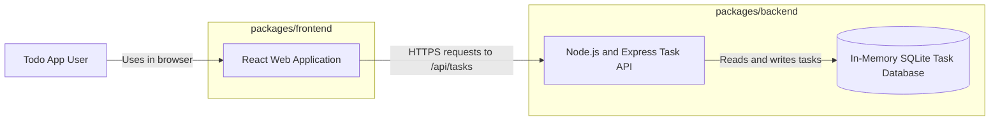
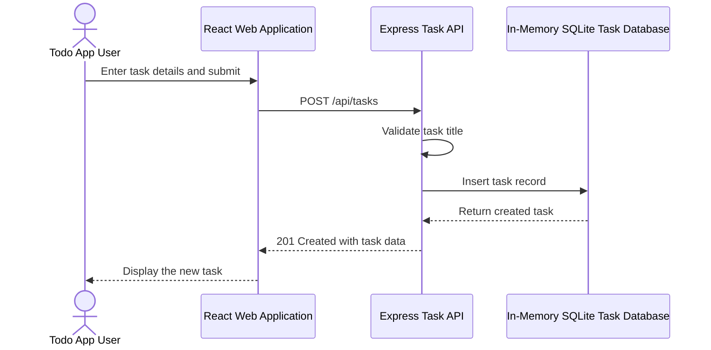

# Cloud Architecture Overview

## System Context

The current application is a local full-stack JavaScript monorepo. No cloud provider, managed service, or deployment topology is defined.

## Create a TODO

